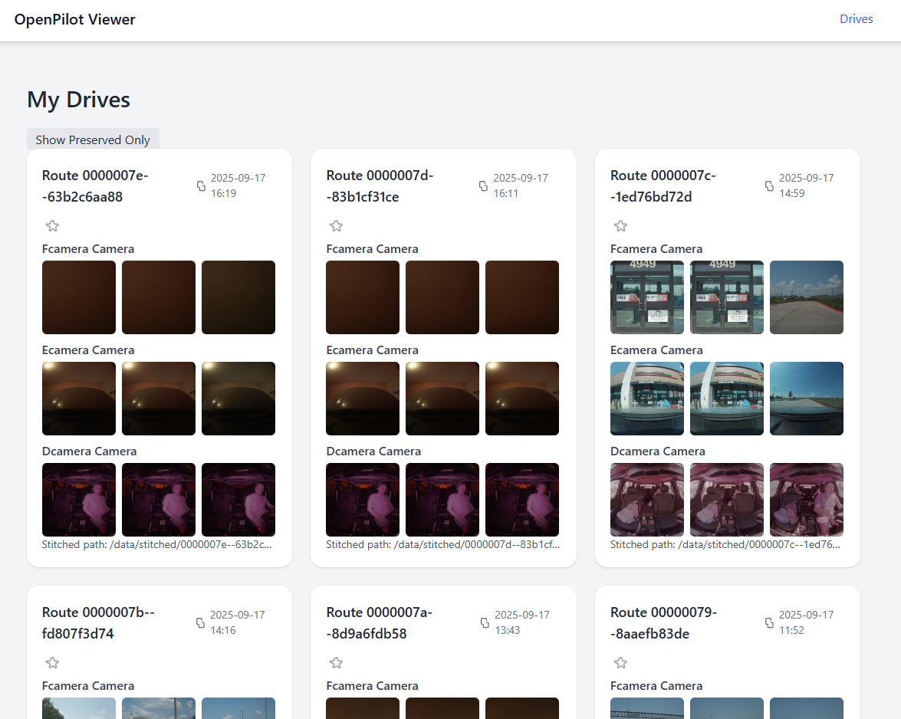
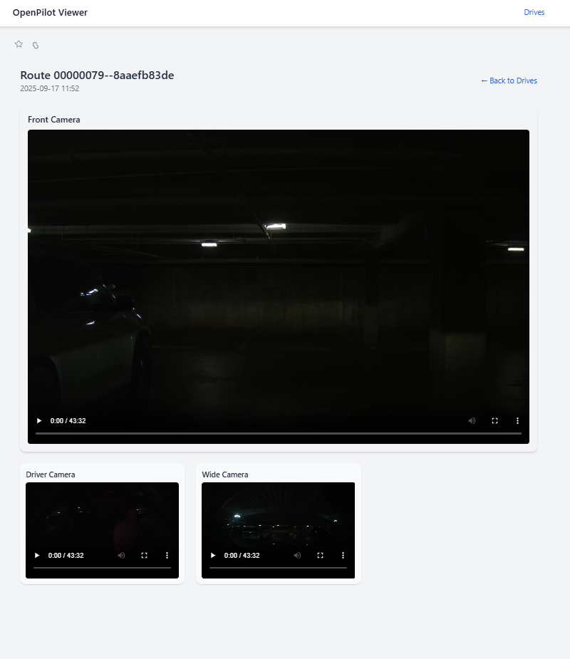

# OpenPilot Viewer

A self-hosted web interface to view your OpenPilot drives (from Comma C3/C3X). Automatically pulls drives over SSH when connected to local network, stitches camera streams into MP4s, and provides a web UI for browsing and watching videos.





## Features

- Automatic syncing of OpenPilot drives from your C3/C3X when on the same network.  
- HEVC video segments stitched into MP4 for each camera.  
- Web interface to browse drives and play stitched videos.  
- Supports Dockerized deployment for easy setup.  
- Automatic deletion of old data when space on disk is below a threshhold.
- Optional “saved” drives to prevent automatic cleanup.  


## Requirements

- OpenMediaVault (OMV) or other Debian-based Linux server  
- Docker & Docker Compose  
- Comma C3 or C3X device on the same network  
- SSH access to the Comma device setup with ssh key.


## 1. Setup Directories on OMV

```bash
# Replace with your OMV disk path
BASE="/srv/dev-disk-by-uuid-xxxxxx/openpilot_data"
mkdir -p $BASE/raw $BASE/stitched $BASE/logs $BASE/metadata
```

## 2. Setup SSH Key for Automatic Sync

Copy your ssh key to the computer you are running the sync script on. I put my key in ~/.ssh/opensshkey . Make sure you are able to connect to your c3/c3x before moving forward. Example:

`ssh -i ~/.ssh/opensshkey comma@192.168.86.85`

## 3. Install Dependencies

On your OMV server, install the required packages for syncing and stitching:

```bash
sudo apt update
sudo apt install ffmpeg rsync
```

## 4. Setup Sync + Stitch Script

Copy the c3x_sync.sh script from this repo onto your pc (I have copied to /usr/local/bin/c3x_sync.sh), then set execution permissions:

`sudo chmod +x c3x_sync.sh`

You will want to edit the top portion of this script with your own configuration.

Notes:

This script will connect to your C3/C3X via SSH, sync any new drives to raw/, and stitch the HEVC camera files into MP4s in stitched/.

Logs are written to logs/c3x_sync.log.

The script checks if the drive is already stitched to avoid redundant processing.

## 5. Setup Cron Job

To automatically run the sync + stitch script every few minutes, use a cron job with `flock` to prevent overlapping runs.

Open the root user's crontab:

```bash
sudo crontab -e
```
Add the following line to run the script every 5 minutes unless already running:
```
*/5 * * * * /usr/bin/flock -n /tmp/c3x_sync.lock /usr/local/bin/c3x_sync.sh
```
## 6. Setup Django Web Interface (Dockerized)

You can run the web interface using the published Docker image `bryangerlach/openpilot-viewer:latest`.

---

### Docker Compose

Create `docker-compose.yml`:

```yaml
services:
  web:
    image: bryangerlach/openpilot-viewer:latest
    restart: unless-stopped
    environment:
      SECRET_KEY: ""
      CSRF_TRUSTED_ORIGINS: "http://localhost"
    volumes:
      - /srv/dev-disk-by-uuid-xxxxxx/openpilot_data/stitched:/data/stitched:ro
      - /srv/dev-disk-by-uuid-xxxxxx/openpilot_data/metadata:/data/metadata
    ports:
      - "80:80"
```
Notes:

SECRET_KEY: Replace with a secure random string. Use this to generate: 
```python
python3 -c 'import secrets; print(secrets.token_hex(100))'
```

CSRF_TRUSTED_ORIGINS: Comma-separated list of URLs for CSRF validation.

Edit the volumes to match your stitched and metadata directories that you setup in the c3x_sync.sh script.
